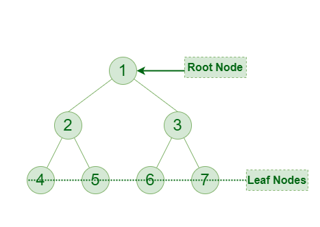

# trees

## binary trees
A binary tree is a hierarchical data structure in which each node has at most two children, referred to as the left child and the right child

- **Root**: The topmost node of a binary tree is called the root.
- **Parent, Child, Sibling**: Each node in a binary tree can be a parent, a child, or a sibling to other nodes.
- **Leaf Node:** A node that does not have any children is called a leaf node or a terminal node.
- **Internal Node:** A node that has at least one child is called an internal node.

## Sinary Search Tree (BST)

A binary tree in which for each node, all nodes in its left subtree have values less than its value, and all nodes in its right subtree have values greater than its value. BSTs are commonly used for searching and sorting.

7. **Traversal**: There are three common ways to traverse (visit all nodes) a binary tree:
   - **Inorder**: Visit the left subtree, then the root, then the right subtree.
   - **Preorder**: Visit the root, then the left subtree, then the right subtree.
   - **Postorder**: Visit the left subtree, then the right subtree, then the root.

8. **Balanced Binary Tree**: A binary tree is considered balanced if the height of its left and right subtrees differ by no more than one level.

9. **Full Binary Tree**:  

10. **Complete Binary Tree**: A binary tree in which all levels are completely filled except possibly for the lowest level, which is filled from left to right.

11. **Perfect Binary Tree**: A binary tree in which all internal nodes have two children and all leaf nodes are at the same level.

12. **Binary Tree Traversal**: There are three main types of binary tree traversal: inorder, preorder, and postorder. Each traversal visits nodes in a different order, allowing you to process or display the nodes in different ways.

13. **Binary Tree Operations**: Common operations on binary trees include insertion, deletion, and searching for nodes.

14. **Binary Tree Representation**: Binary trees can be represented using nodes with references to their left and right children. Each node contains a value and pointers to its left and right children.

